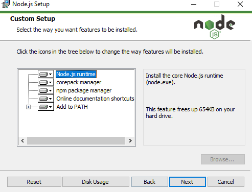
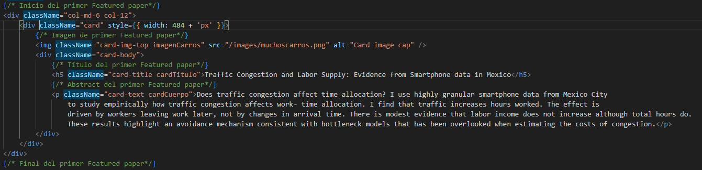
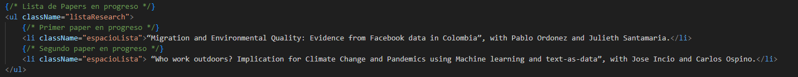
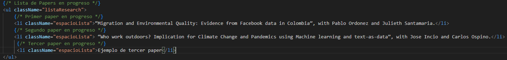
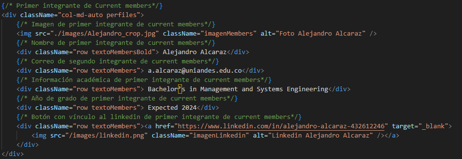
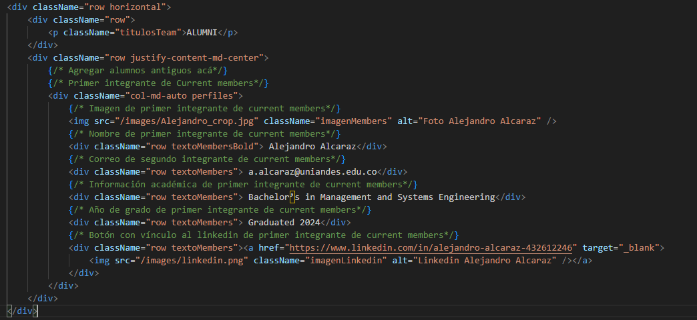

# Tutorial de modificación de ENTRA Lab

## Introducción

De forma muy simplificada, la página web del ENTRA Lab tiene la siguiente estructura de archivos: 
- vite-project: carpeta que contiene el proyecto en Vite.
- pages: Subcarpeta ubicada dentro de src, donde se encuentran las tres páginas del laboratorio: 
  - PaginaPrincipal.jsx: Página principal del laboratorio.
  - Research.jsx: Página con los papers de investigación desarrollados en el laboratorio.
  - Team.jsx: Página con la información de los miembros de laboratorio.

Para ejecutar la página localmente, necesitaremos instalar Node y npm.
- descargar la versión más reciente de Node a través de su página web oficial: https://nodejs.org/en/download/prebuilt-installer
- abrir el archivo descargado, esto comenzará la instalación
- Elegir la ubicación de la instalación e instalar las características predeterminadas como indica la foto:
-  
-  Al finalizar la instalación, abrir el Command Prompt y confirmar la instalación de los programas a través de los siguientes comandos:
   -  node -v 
   -  npm -v

- Con npm instalado correctamente, procederemos a abrir el proyecto en el editor de código preferido (Recomendado: Visual Studio Code)
- Ahora, abrir un terminal en el editor de código y dirigirse a la carpeta vite-proyect con el comando cd vite-project
- Cuando estemos ubicados en vite-project, ejecutar npm install
- ejecutar npm run dev
- La página se ejecutará en un puerto local, ábrela en tu navegador preferido y cada cambio que guardes se mostrará instanstáneamente.

## Cómo añadir papers a la pestaña de Research

### Añadir Featured Papers 
- En vite-project/src/pages abrir Research.jsx en el editor
- Identificar la estructura de cada featured paper, el inicio, la imagen, el título, el abstract y el final del featured paper está delimitado a través de comentarios como lo muestra la foto a continuación
- 
- Para modificar la foto, debes subirla primero a la carpeta vite-project/public/images. Después, en la línea indicada de la foto cambiar el valor del parámetro src por "/images/nombreimagennueva". Debe incluir el .png o .jpg o el tipo de imagen que sea. 
- Para modificar el título y el cuerpo solo es cambiarlo en la sección indicada.
- Recuerda: Si vas a añadir otro featured paper debes copiar y pegar TODO desde la primera división hasta el último tag que cierra esa división. Como lo muestra la foto anterior.

### Añadir papers en progreso, working papers y publications
- Dentro de Research, identificar la lista que se busca modificar. A continuación se muestra la lista de papers en progreso como ejemplo.
- 
- Para añadir papers en progreso, duplica uno de los papers que ya existe y añádelo a la lista. Usando como ejemplo los papers en progreso sería así:
- 
- Como puedes ver, cada paper está rodeado por un tag \<li>\</li>. Este proceso es replicable para los otros dos tipos de papers, pues también tienen esta estructura de lista y su modificación es semejante.
- La única diferencia es si se desean añadir hipervínculos, como en el paper de publications. En este caso, la palabra que queremos convertir en hipervínculo debe ser rodeada del tag \<a>\</a>, este elemento tendrá como parámetros href = "link de la publicación" y target = "_blank". Este target significa que al hacer click en la palabra se abrirá una nueva pestaña con el link de href.

## Modificar integrantes del equipo de ENTRA Lab

### Añadir current members
- En vite-project/src/pages abrir Team.jsx en el editor
- Identificar la sección de current members, a continuación se muestra el primer integrante con la información requerida. Copiar y pegar la totalidad de la división del integrante para añadir uno nuevo.
- 
- Igual que para subir imágenes en research, debes subir la foto primero a la carpeta vite-project/public/images. Después, en la línea indicada de la foto cambiar el valor del parámetro src por "/images/nombreimagennueva". Esta ubicación debe incluir el .png o .jpg o el tipo de imagen que sea.
- Modificar el nombre, el correo, la información académica y el año de grado simplemente cambiando el texto.
- Para modificar el linkedin, modificar el valor del href poniendo el link al linkedin del integrante nuevo. 

### Añadir alumni
- La estructura será igual que la de current members, así que para añadir alumni simplemente debes cortar la división del current member que vas a mover a alumni y pegarla en el lugar indicado. A continuación se muestra un ejemplo de un alumni: 
- 
- Como se puede ver, la única modificación sería poner el año de graduación del ex-integrante, pero la estructura es igual a la de los current members.

## Modificar hoja de vida
El archivo pdf de la hoja de vida se encuentra en la carpeta vite-project/public/docs con el nombre de CV_MinoruHiga.pdf. Si se quiere modificar, solo es resubir el pdf con el mismo nombre a la misma ubicación, remplazando el archivo anterior.

## Modificar Imágenes Página Principal
Como ya fue mencionado anteriormente, todas las imágenes se encuentran en la carpeta vite-project/public/images. Por lo tanto, si queremos modificarlas debemos remplazar ya sea foto research.jpg o Group.jpg.